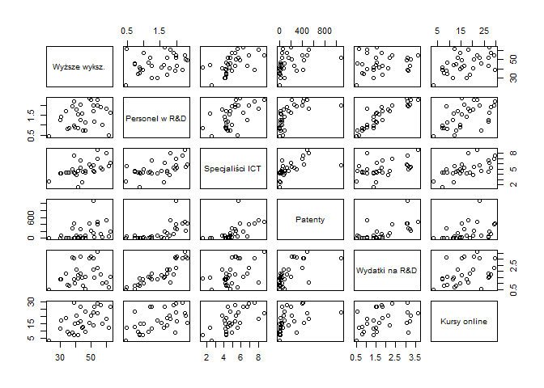
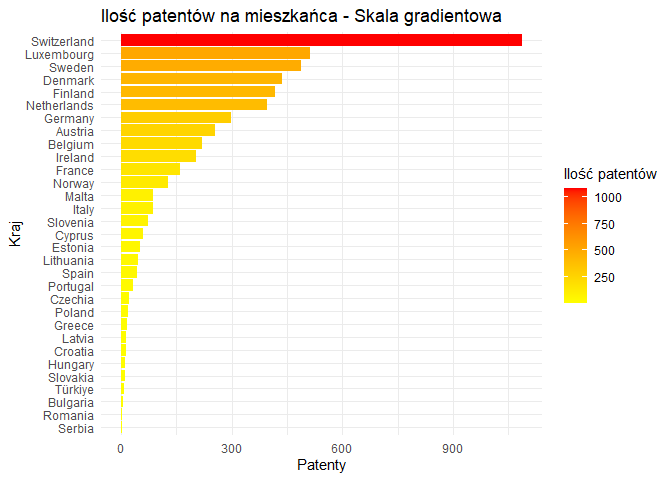
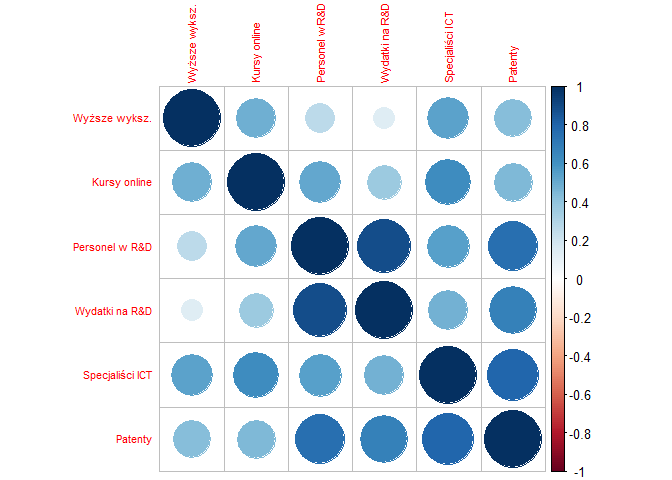
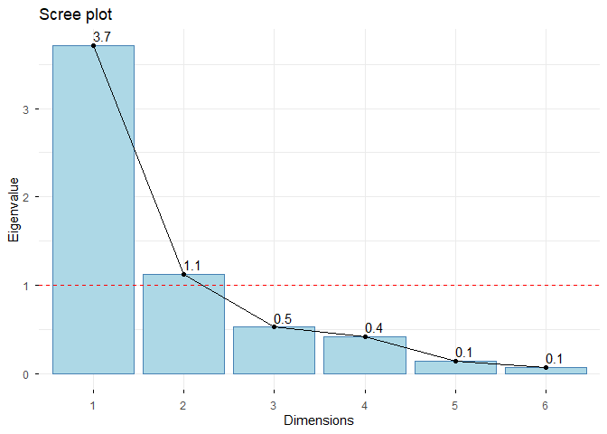
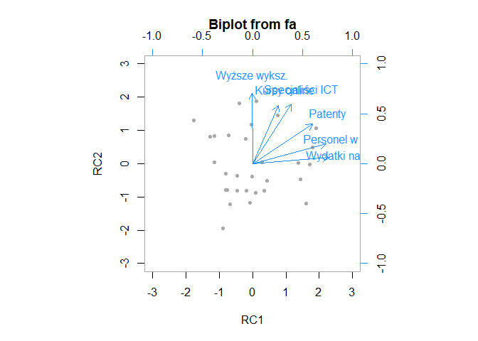
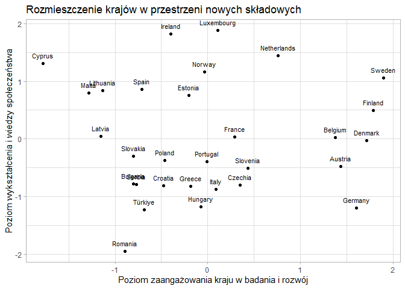

# 🇪🇺 Analiza Potencjału Innowacyjnego i Cyfrowego Krajów Europy (PCA & Clustering)

##  1. Opis i cel projektu

Celem projektu jest analiza porównawcza potencjału innowacyjnego i cyfrowego **31 państw** (kraje UE oraz m.in. Norwegia, Szwajcaria, Turcja). Wybrane zmienne odzwierciedlają poziom edukacji, zaawansowanie technologiczne rynku pracy oraz aktywność naukową. 

Dane są znormalizowane (wskaźniki procentowe lub *per capita*), co pozwala na rzetelne porównanie krajów o różnej wielkości. Dane pochodzą z bazy **Eurostat** (rok 2023).

### Zmienne wykorzystane w analizie:
* **Wykształcenie wyższe:** Udział populacji w wieku 25–34 lat z wykształceniem wyższym (%).
* **Personel B+R:** Udział personelu zajmującego się badaniami i rozwojem (ekwiwalent pełnego czasu pracy) w sile roboczej.
* **Specjaliści ICT:** Udział specjalistów ICT w całkowitym zatrudnieniu (%).
* **Patenty:** Liczba zgłoszeń do Europejskiego Urzędu Patentowego (EUP) na mln mieszkańców.
* **Wydatki na B+R:** Wydatki na badania i rozwój wyrażone jako % PKB.
* **Kursy online:** Odsetek osób korzystających z Internetu, które realizują kursy online (%).

### Tabela zmiennych z bazy Eurostat

| Nazwa zmiennej w projekcie | Nazwa zmiennej w bazie Eurostat | Kod Eurostat |
| :--- | :--- | :--- |
| **Wyższe wyksz.** | Osoby w wieku 25–34 lata z wykształceniem wyższym | `[sdg_04_20__custom_20918062]` |
| **Personel w R&D** | Personel B+R według sektora | `[sdg_09_30__custom_20918259]` |
| **Specjaliści ICT** | Zatrudnieni specjaliści ICT | `[isoc_sks_itspt$defaultview]` |
| **Patenty** | Wnioski patentowe do EUP | `[sdg_09_40__custom_20845664]` |
| **Wydatki R&D** | Wydatki na badania i rozwój (% PKB) | `[tsc00001]` |
| **Kursy online** | Osoby odbywające kursy online | `[isoc_ci_ac_i__custom_20920680]` |

---

## 🛠️ 2. Przygotowanie danych

W pierwszym etapie przeprowadzono wstępną analizę danych oraz analizę zależności.

Na tej podstawie zauważono obecność wartości odstającej w zmiennej odnoszącej się do liczby składanych patentów. Analiza wykresu słupkowego wykazała, że krajem znacząco odbiegającym od pozostałych jest *Szwajcaria*.

W celu poprawy jakości analizy usunięto Szwajcarię ze zbioru danych, co pozwoliło uzyskać bardziej jednorodną grupę i zapobiec zniekształceniu dalszych wyników.

##  3. Analiza Składowych Głównych (PCA)

Zanim przystąpimy do redukcji wymiarów, należy sprawdzić zasadność użycia PCA za pomocą testów statystycznych.

#### **A. Macierz korelacji:**

Analiza macierzy korelacji potwierdziła silne powiązania między zmiennymi, co uzasadnia użycie PCA. 

*	Najsilniejsza korelacja występuje między Wydatkami na R&D a Personelem w R&D, co wskazuje, że kraje inwestujące finansowo w naukę jednocześnie dysponują rozbudowaną kadrą badawczą. Liczba Patentów również jest silnie powiązana z powyższymi zmiennymi. Sugeruje to, że duża liczba zgłoszeń patentowych jest silnie powiązana z nakładami kraju na badania i rozwój. 
* Zmienna Kursy online wykazuje wyraźną dodatnią korelację z Wykształceniem wyższym oraz obecnością Specjalistów ICT, co pozwala sądzić, że samokształcenie cyfrowe współwystępuje z formalnym wykształceniem wysokiej klasy.

#### **B. Test Bartletta:** 

* H0: Macierz korelacji zmiennych jest macierzą jednostkową. Oznacza to, że zmienne nie są ze sobą skorelowane, a przeprowadzenie analizy PCA jest bezcelowe.
* H1: Macierz korelacji nie jest macierzą jednostkową. Między zmiennymi występują istotne statystycznie zależności, co uzasadnia zastosowanie analizy składowych głównych.

$p\text{-value} = 3.42 \cdot 10^{-86} < 0.05$ $\rightarrow$ Odrzucenie $H_0$
Między zmiennymi występują istotne zależności

#### **C. Wskaźnik KMO:** 
$\text{Overall MSA} = 0.68$ (powyżej progu $0.5$) $\rightarrow$ 
Umiarkowana adekwatność doboru zmiennych

> **Wniosek**: Na podstawie powyższych kryteriów można stwierdzić, że analiza PCA jest jak najbardziej dozwolona.

### Uzasadnienie wyboru składowych

#### A. Wyniki PCA dla 6 składowych
| Wskaźnik | PC1 | PC2 | PC3 | PC4 | PC5 | PC6 |
| :--- | :---: | :---: | :---: | :---: | :---: | :---: |
| **SS loadings (Wartość własna)** | **3.708** | **1.128** | 0.530 | 0.422 | 0.142 | 0.071 |
| **Proportion Var** | **0.618** | **0.188** | 0.088 | 0.070 | 0.024 | 0.012 |
| **Cumulative Var** | **0.618** | **0.806** | 0.894 | 0.965 | 0.988 | 1.000 |

Pierwsza składowa (PC1) tłumaczy aż 61,8% całkowitej zmienności danych, natomiast druga (PC2) kolejne 18,8%. Łącznie dwie pierwsze składowe wyjaśniają 80,6% (Cumulative Var = 0,806) wariancji całego zbioru.

#### B. Wykres osypiska

Zgodnie z Kryterium Kaisera wybieramy składowe, których wartości własne (SS loadings) przekraczają 1. W naszym przypadku warunek ten spełniają dwie składowe: PC1 (3,7) oraz PC2 (1,1). Pozostałe składowe (PC3–PC6) niosą ze sobą mniej informacji niż pojedyncza zmienna wejściowa.

> **Wniosek:** Na podstawie powyższych wyników, do dalszej analizy wybieramy dwie składowe.
Wybór dwóch wymiarów pozwala na uproszczenie analizy z 6 zmiennych do zaledwie 2 nowych osi, przy utracie jedynie 19,4% pierwotnej informacji. Jest to wynik uznawany za bardzo satysfakcjonujący.

### Interpretacja składowych (Po rotacji Varimax)

Dla łatwiejszej interpretacji nowych zmiennych dokonano rotacji Varimax. Następnie przeanalizowano otrzymane ładunki czynnikowe. Ładunki te określają siłę korelacji między oryginalnymi zmiennymi a nowymi składowymi (RC1 i RC2).

<table>
  <tr>
    <td width="55%" valign="top">
      
    </td>
    <td width="45%" valign="top">

#### Ładunki czynnikowe
| Zmienna | RC1 | RC2  |
| :--- | :---: | :---: |
| **Wydatki na R&D** | **0.951** | - |
| **Personel w R&D** | **0.922** | 0.249 |
| **Patenty** | **0.751** | 0.495 |
| **Wyższe wykształcenie** | - | **0.883** |
| **Specjaliści ICT** | 0.488 | **0.743** |
| **Kursy online** | 0.323 | **0.730** |

  </tr>
</table>

#### **Składowa RC1:** Poziom zaangażowania kraju w badania i rozwój
Ta składowa skupia zmienne związane z instytucjonalnym zaangażowaniem w badania i rozwój. Najwyższe ładunki posiadają:
* Wydatki na R&D (0,951) – kluczowa zmienna finansowa, niemal całkowicie utożsamiana z RC1
* Personel w R&D (0,922) – wysoki udział kadry naukowej w zatrudnieniu
* Patenty (0,751) – mierzalne efekty pracy badawczej
>**Interpretacja:** RC1 reprezentuje Potencjał Badawczo-Rozwojowy. Kraje o wysokich wartościach tej składowej to państwa stawiające na finansowe wsparcie nauki, posiadające rozbudowane zaplecze laboratoryjne. Istnieje silna współzależność między nakładami finansowymi a liczebnością kadry badawczej natomiast efektem wysokich nakładów i finansowych i kadrowych są zgłoszenia patentowe.

#### **Składowa RC2:** Poziom wykształcenia i wiedzy społeczeństwa, samorozwój
Ta składowa koncentruje się na profilu społeczeństwa i jego umiejętnościach. Najwyższe ładunki posiadają:
*	Wyższe wykształcenie (0,883) – dominująca zmienna opisująca poziom edukacji formalnej młodego społeczeństwa
*	Specjaliści ICT (0,743) – nasycenie rynku pracy ekspertami od nowoczesnych technologii
*	Kursy online (0,730) – otwartość na nowoczesne formy kształcenia i samorozwój
>**Interpretacja:** RC2 reprezentuje Nowoczesne Społeczeństwo Informacyjne. Wysokie wartości RC2 charakteryzują kraje o bardzo wysokim poziomie wykształcenia obywateli oraz silnym zapleczem kompetencyjnym dla sektora informacyjno-technologicznego. Wysokie wyniki w tym obszarze sugerują, że kraj posiada dużą bazę specjalistów gotowych do wdrażania innowacji technologicznych. A wysoki ładunek zmiennej dotyczącej kursów online świadczy o chęci samorozwoju i kształcenia się obywateli.

### Rozmieszczenie krajów w przestrzeni RC1 vs RC2

<table>
  <tr>
    <td width="55%" valign="top">
      
    </td>
    <td width="45%" valign="top">

#### Rozmieszczenie krajów (RC1 vs RC2)
* **Szwecja i Finlandia:** Liderzy w obu wymiarach.
* **Niemcy:** Lider jednostronny (wysoki potencjał B+R, przeciętny wymiar społeczny).
* **Irlandia i Luksemburg:** Liderzy w zakresie kapitału ludzkiego i ICT.
* **Cypr:** Nietypowy outlier (wysokie wykształcenie, znikome B+R).
* **Rumunia:** Najniższe wartości w wymiarze społecznym.

    </td>
  </tr>
</table>

---

##  4. Analiza Skupień (Clustering)

---
*Projekt zrealizowany w RStudio.*
