eu-pca-clustering
================
Patrycja Kornobis
2026-08-02

``` r
# Załadowanie potrzebnych bibliotek
library(readxl)
library(tidyverse)
```

    ## Warning: pakiet 'ggplot2' został zbudowany w wersji R 4.4.3

    ## Warning: pakiet 'dplyr' został zbudowany w wersji R 4.4.3

    ## ── Attaching core tidyverse packages ──────────────────────── tidyverse 2.0.0 ──
    ## ✔ dplyr     1.1.4     ✔ readr     2.1.5
    ## ✔ forcats   1.0.0     ✔ stringr   1.5.1
    ## ✔ ggplot2   4.0.2     ✔ tibble    3.2.1
    ## ✔ lubridate 1.9.4     ✔ tidyr     1.3.1
    ## ✔ purrr     1.0.2     
    ## ── Conflicts ────────────────────────────────────────── tidyverse_conflicts() ──
    ## ✖ dplyr::filter() masks stats::filter()
    ## ✖ dplyr::lag()    masks stats::lag()
    ## ℹ Use the conflicted package (<http://conflicted.r-lib.org/>) to force all conflicts to become errors

``` r
library(ggrepel)
```

    ## Warning: pakiet 'ggrepel' został zbudowany w wersji R 4.4.3

``` r
library(psych)
```

    ## Warning: pakiet 'psych' został zbudowany w wersji R 4.4.3

    ## 
    ## Dołączanie pakietu: 'psych'
    ## 
    ## Następujące obiekty zostały zakryte z 'package:ggplot2':
    ## 
    ##     %+%, alpha

``` r
library(FactoMineR)
```

    ## Warning: pakiet 'FactoMineR' został zbudowany w wersji R 4.4.3

``` r
library(dplyr)
library(ggplot2)
library(factoextra)
```

    ## Warning: pakiet 'factoextra' został zbudowany w wersji R 4.4.3

    ## Welcome to factoextra!
    ## Want to learn more? See two factoextra-related books at https://www.datanovia.com/en/product/practical-guide-to-principal-component-methods-in-r/

``` r
library(DataExplorer)
```

    ## Warning: pakiet 'DataExplorer' został zbudowany w wersji R 4.4.3

``` r
library(fpc) 
```

    ## Warning: pakiet 'fpc' został zbudowany w wersji R 4.4.3

``` r
library(corrplot)
```

    ## Warning: pakiet 'corrplot' został zbudowany w wersji R 4.4.3

    ## corrplot 0.95 loaded

``` r
#============================== P  C  A ========================================


# załadownaie w przekształcenie danych
eu <- read_excel("data/dane.xlsx")
names(eu) <- c( "Kraj" , "Wyższe wyksz.", "Personel w R&D",
                "Specjaliści ICT", "Patenty", "Wydatki na R&D", "Kursy online")

# sprawdzamy na wykresie punktowym czy istnieją wartości odstające
pairs(eu[, -1])
```

<!-- -->

``` r
# możemy zauważyć, że jeden kraj odstają od reszty pod względem liczby patentów

# identyfikacja kraju z odstającą ilością patentów
eu %>% 
  ggplot(aes(x = Patenty, 
             y = reorder(Kraj, Patenty), 
             fill = Patenty)) + 
  geom_col() +
  scale_fill_gradient(low = "yellow", high = "red") +
  theme_minimal() +
  labs( y = "Kraj",
        title = "Ilość patentów na mieszkańca - Skala gradientowa", 
        fill = "Ilość patentów")
```

<!-- -->

``` r
# teraz możemy zauważyć, że tym krajem jest Szwajcarja

# odrzucamy ten kraj 
eu <- eu %>% filter(!Kraj %in% c("Switzerland") )


# 1. SPRAWDZAMY czy można zrobic pca? ---------------------------------------------

# wykres korelacji
corrplot(cor(eu[, -1]), order = "hclust", tl.cex = 0.7) 
```

<!-- -->

``` r
# test bartletta
cortest.bartlett(cor(eu[, -1])) 
```

    ## Warning in cortest.bartlett(cor(eu[, -1])): n not specified, 100 used

    ## $chisq
    ## [1] 448.9528
    ## 
    ## $p.value
    ## [1] 3.422281e-86
    ## 
    ## $df
    ## [1] 15

``` r
# p-value < 0,05 

# KMO kryterium
KMO(cor(eu[, -1])) 
```

    ## Kaiser-Meyer-Olkin factor adequacy
    ## Call: KMO(r = cor(eu[, -1]))
    ## Overall MSA =  0.68
    ## MSA for each item = 
    ##   Wyższe wyksz.  Personel w R&D Specjaliści ICT         Patenty  Wydatki na R&D 
    ##            0.86            0.64            0.67            0.70            0.70 
    ##    Kursy online 
    ##            0.63

``` r
# Overall MSA =  0.68

# na podstawie powyższych kryteriów stwierdzamy, że można wykonać pca


# 2. wybór LICZBY SKŁADOWYCH ---------------------------------------------------

# najpierw przeprowadzamy PCA dla 6 składowych, 
# aby wybrać ostateczną liczbe nowych wymiarów
pr.eu0 <- principal( eu[, -1], nfactors = 6, rotate = "none")
pr.eu0$loadings
```

    ## 
    ## Loadings:
    ##                 PC1    PC2    PC3    PC4    PC5    PC6   
    ## Wyższe wyksz.    0.560  0.682 -0.224  0.412              
    ## Personel w R&D   0.868 -0.396         0.185 -0.113 -0.182
    ## Specjaliści ICT  0.849  0.261 -0.141 -0.385  0.185       
    ## Patenty          0.894        -0.314 -0.177 -0.220  0.111
    ## Wydatki na R&D   0.781 -0.548         0.183  0.207  0.115
    ## Kursy online     0.714  0.357  0.593                     
    ## 
    ##                  PC1   PC2   PC3   PC4   PC5   PC6
    ## SS loadings    3.708 1.128 0.530 0.422 0.142 0.071
    ## Proportion Var 0.618 0.188 0.088 0.070 0.024 0.012
    ## Cumulative Var 0.618 0.806 0.894 0.965 0.988 1.000

``` r
# pierwsza skladowa wyjasnia 62%, druga 19% zmiennościu zbioru danych
# w sumie pierwsze 2 wyjasniaja ok. 80% zmiennosci, co jest dobrym wynikiem


# wykres osypiska
fviz_screeplot( PCA(eu[, -1],graph = FALSE ), barfill = "lightblue", 
                addlabels = TRUE, choice = "eigenvalue") +
  geom_hline(yintercept = 1, linetype = "dashed", color = "red")
```

<!-- -->

``` r
# dwie skladowe powyzej 1 (kryterium Kaisera)

# WNIOSEK: wybieramy 2 składowe


# 3. ANALIZA i INTERPRETACJA składowych ----------------------------------------

pr.eu <- principal( eu[, -1], nfactors = 2, rotate = "none")
pr.eu
```

    ## Principal Components Analysis
    ## Call: principal(r = eu[, -1], nfactors = 2, rotate = "none")
    ## Standardized loadings (pattern matrix) based upon correlation matrix
    ##                  PC1   PC2   h2    u2 com
    ## Wyższe wyksz.   0.56  0.68 0.78 0.221 1.9
    ## Personel w R&D  0.87 -0.40 0.91 0.089 1.4
    ## Specjaliści ICT 0.85  0.26 0.79 0.210 1.2
    ## Patenty         0.89 -0.10 0.81 0.191 1.0
    ## Wydatki na R&D  0.78 -0.55 0.91 0.090 1.8
    ## Kursy online    0.71  0.36 0.64 0.363 1.5
    ## 
    ##                        PC1  PC2
    ## SS loadings           3.71 1.13
    ## Proportion Var        0.62 0.19
    ## Cumulative Var        0.62 0.81
    ## Proportion Explained  0.77 0.23
    ## Cumulative Proportion 0.77 1.00
    ## 
    ## Mean item complexity =  1.5
    ## Test of the hypothesis that 2 components are sufficient.
    ## 
    ## The root mean square of the residuals (RMSR) is  0.06 
    ##  with the empirical chi square  3.09  with prob <  0.54 
    ## 
    ## Fit based upon off diagonal values = 0.99

``` r
old.par <- par() 
biplot(pr.eu)
```

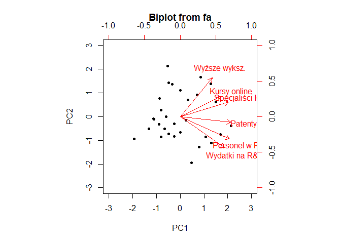<!-- -->

``` r
par(old.par)
```

    ## Warning in par(old.par): parametr graficzny 'cin' nie może zostać ustawiony

    ## Warning in par(old.par): parametr graficzny 'cra' nie może zostać ustawiony

    ## Warning in par(old.par): parametr graficzny 'csi' nie może zostać ustawiony

    ## Warning in par(old.par): parametr graficzny 'cxy' nie może zostać ustawiony

    ## Warning in par(old.par): parametr graficzny 'din' nie może zostać ustawiony

    ## Warning in par(old.par): parametr graficzny 'page' nie może zostać ustawiony

``` r
# wykonujemy dodatkową rotacje dla łatwiejszej interpretacji składowych 
pr.eu <- principal( eu[, -1], nfactors = 2, rotate = "varimax")
pr.eu$loadings
```

    ## 
    ## Loadings:
    ##                 RC1    RC2   
    ## Wyższe wyksz.           0.883
    ## Personel w R&D   0.922  0.249
    ## Specjaliści ICT  0.488  0.743
    ## Patenty          0.751  0.495
    ## Wydatki na R&D   0.951       
    ## Kursy online     0.323  0.730
    ## 
    ##                  RC1   RC2
    ## SS loadings    2.659 2.177
    ## Proportion Var 0.443 0.363
    ## Cumulative Var 0.443 0.806

``` r
old.par <- par() 
biplot(pr.eu, col = c("darkgrey", "#1E90FF"), pch = 16)
```

<!-- -->

``` r
par(old.par)
```

    ## Warning in par(old.par): parametr graficzny 'cin' nie może zostać ustawiony

    ## Warning in par(old.par): parametr graficzny 'cra' nie może zostać ustawiony

    ## Warning in par(old.par): parametr graficzny 'csi' nie może zostać ustawiony

    ## Warning in par(old.par): parametr graficzny 'cxy' nie może zostać ustawiony

    ## Warning in par(old.par): parametr graficzny 'din' nie może zostać ustawiony

    ## Warning in par(old.par): parametr graficzny 'page' nie może zostać ustawiony

``` r
# Interpretacja nowych składowych
# RC1 - Poziom zaangażowania kraju w badania i rozwój
#       wysokie wydatki na R&D > wiecej presonelu > więcej zgłoszeń patentowych
# RC2 - Poziom wykształcenia i wiedzy społeczeństwa
#       to co ludzie potrafią i jak się rozwijają (samokształcenie, studia)
#       jakość wiedzy, specjaliści > wysoka wiedza technologiczna 


# 4. wykres z nowymi składowymi ------------------------------------------------

# ramaka danych z wartościami nowych składowych 
eu.RC <- pr.eu$scores %>% as.data.frame()
names(eu.RC) <- c("Poziom zaangażowania kraju w badania i rozwój",
                  "Poziom wykształcenia i wiedzy społeczeństwa")
eu.RC$Kraj <- eu$Kraj


# Rozmieszczenie krajów w przestrzeni nowych składowych
eu.RC %>% 
  ggplot( aes( x=`Poziom zaangażowania kraju w badania i rozwój`,
               y = `Poziom wykształcenia i wiedzy społeczeństwa`))+
  geom_point()+
  geom_text(aes(label = Kraj), vjust = -1, size = 3)+
  theme_light()+
  labs(title = "Rozmieszczenie krajów w przestrzeni nowych składowych")
```

<!-- -->

``` r
#============================= ANALIZA SKUPIEŃ =================================


# SPRAWDZENIE danych, rozkladow ------------------------------------------------

# ponowne sprawdzenie danych
pairs(eu[, -1])
```

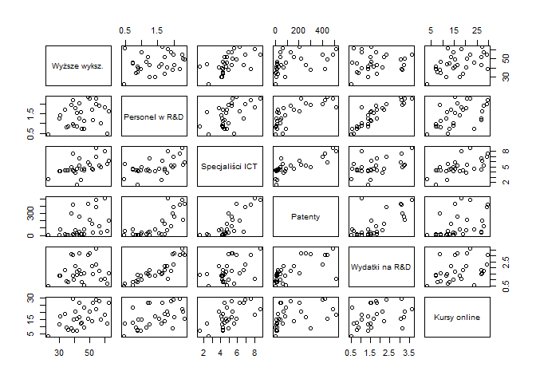<!-- -->

``` r
# przez wcześniejsze odrzucenie odstającego kraju teraz wszystko jest w porządku


# STANDARYZACJA ----------------------------------------------------------------
eu.scaled <- scale(eu[, -1]) %>% as.data.frame()
summary(eu.scaled) # sprawdzamy dane, wszystkie średnie równe 0
```

    ##  Wyższe wyksz.      Personel w R&D     Specjaliści ICT      Patenty       
    ##  Min.   :-2.24809   Min.   :-1.74242   Min.   :-2.2103   Min.   :-0.8247  
    ##  1st Qu.:-0.59996   1st Qu.:-0.90546   1st Qu.:-0.4164   1st Qu.:-0.7480  
    ##  Median :-0.08743   Median : 0.09093   Median :-0.1922   Median :-0.4946  
    ##  Mean   : 0.00000   Mean   : 0.00000   Mean   : 0.0000   Mean   : 0.0000  
    ##  3rd Qu.: 0.71402   3rd Qu.: 0.82161   3rd Qu.: 0.3844   3rd Qu.: 0.4774  
    ##  Max.   : 1.79184   Max.   : 1.60543   Max.   : 2.4025   Max.   : 2.3004  
    ##  Wydatki na R&D     Kursy online    
    ##  Min.   :-1.3691   Min.   :-1.8077  
    ##  1st Qu.:-0.7783   1st Qu.:-0.6711  
    ##  Median :-0.2438   Median :-0.1813  
    ##  Mean   : 0.0000   Mean   : 0.0000  
    ##  3rd Qu.: 0.4848   3rd Qu.: 0.6706  
    ##  Max.   : 2.1418   Max.   : 1.7604

``` r
# grupowanie HIERARCHICZNE -----------------------------------------------------

d <- dist(eu.scaled, method = "euclidean") # macierz dystnsu 

## grupowanie metodą WARDERA ---------------------------------------------------
hc1 <- hclust(d, method = "ward.D2")       # tworzymy obiekt klasy hclust

# dendogram 
plot(hc1, 
     labels = eu$Kraj, 
     cex = 0.6,
     main = "Analiza skupień krajów europejskich", 
     sub = "",                                    
     xlab = "Kraje",                              
     ylab = "Dystans (Euklidesowy)"               
)
# na dendogramie widać wyraźny podział na 2, 3 grupy 

# sprawdzamy ich liczebność
# podział na 2 grupy 
cutree(hc1, k = 2) %>% table()
```

    ## .
    ##  1  2 
    ##  8 22

``` r
# podział na 3 grupy
cutree(hc1, k = 3) %>% table()
```

    ## .
    ##  1  2  3 
    ##  8 15  7

``` r
# wybieramy podziałna 3 grupy 
plot(hc1, 
     labels = eu$Kraj, 
     cex = 0.6,
     main = "Analiza skupień krajów europejskich", 
     sub = "",                                    
     xlab = "Kraje",                              
     ylab = "Dystans (Euklidesowy)"               
)
rect.hclust(hc1, k = 3, border = c("#F8766D", "#619CFF","#00BA38"))
```

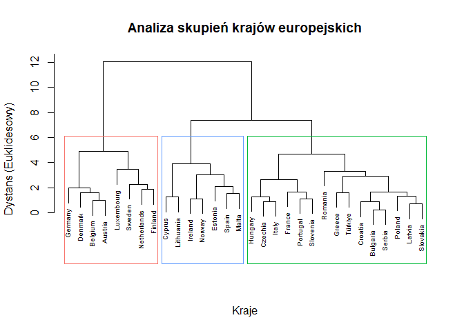<!-- -->

``` r
# stabilność grup 
clusterboot(eu.scaled, B = 500,
            clustermethod = hclustCBI, method = "ward.D2", k = 3)
```

    ## boot 1 
    ## boot 2 
    ## boot 3 
    ## boot 4 
    ## boot 5 
    ## boot 6 
    ## boot 7 
    ## boot 8 
    ## boot 9 
    ## boot 10 
    ## boot 11 
    ## boot 12 
    ## boot 13 
    ## boot 14 
    ## boot 15 
    ## boot 16 
    ## boot 17 
    ## boot 18 
    ## boot 19 
    ## boot 20 
    ## boot 21 
    ## boot 22 
    ## boot 23 
    ## boot 24 
    ## boot 25 
    ## boot 26 
    ## boot 27 
    ## boot 28 
    ## boot 29 
    ## boot 30 
    ## boot 31 
    ## boot 32 
    ## boot 33 
    ## boot 34 
    ## boot 35 
    ## boot 36 
    ## boot 37 
    ## boot 38 
    ## boot 39 
    ## boot 40 
    ## boot 41 
    ## boot 42 
    ## boot 43 
    ## boot 44 
    ## boot 45 
    ## boot 46 
    ## boot 47 
    ## boot 48 
    ## boot 49 
    ## boot 50 
    ## boot 51 
    ## boot 52 
    ## boot 53 
    ## boot 54 
    ## boot 55 
    ## boot 56 
    ## boot 57 
    ## boot 58 
    ## boot 59 
    ## boot 60 
    ## boot 61 
    ## boot 62 
    ## boot 63 
    ## boot 64 
    ## boot 65 
    ## boot 66 
    ## boot 67 
    ## boot 68 
    ## boot 69 
    ## boot 70 
    ## boot 71 
    ## boot 72 
    ## boot 73 
    ## boot 74 
    ## boot 75 
    ## boot 76 
    ## boot 77 
    ## boot 78 
    ## boot 79 
    ## boot 80 
    ## boot 81 
    ## boot 82 
    ## boot 83 
    ## boot 84 
    ## boot 85 
    ## boot 86 
    ## boot 87 
    ## boot 88 
    ## boot 89 
    ## boot 90 
    ## boot 91 
    ## boot 92 
    ## boot 93 
    ## boot 94 
    ## boot 95 
    ## boot 96 
    ## boot 97 
    ## boot 98 
    ## boot 99 
    ## boot 100 
    ## boot 101 
    ## boot 102 
    ## boot 103 
    ## boot 104 
    ## boot 105 
    ## boot 106 
    ## boot 107 
    ## boot 108 
    ## boot 109 
    ## boot 110 
    ## boot 111 
    ## boot 112 
    ## boot 113 
    ## boot 114 
    ## boot 115 
    ## boot 116 
    ## boot 117 
    ## boot 118 
    ## boot 119 
    ## boot 120 
    ## boot 121 
    ## boot 122 
    ## boot 123 
    ## boot 124 
    ## boot 125 
    ## boot 126 
    ## boot 127 
    ## boot 128 
    ## boot 129 
    ## boot 130 
    ## boot 131 
    ## boot 132 
    ## boot 133 
    ## boot 134 
    ## boot 135 
    ## boot 136 
    ## boot 137 
    ## boot 138 
    ## boot 139 
    ## boot 140 
    ## boot 141 
    ## boot 142 
    ## boot 143 
    ## boot 144 
    ## boot 145 
    ## boot 146 
    ## boot 147 
    ## boot 148 
    ## boot 149 
    ## boot 150 
    ## boot 151 
    ## boot 152 
    ## boot 153 
    ## boot 154 
    ## boot 155 
    ## boot 156 
    ## boot 157 
    ## boot 158 
    ## boot 159 
    ## boot 160 
    ## boot 161 
    ## boot 162 
    ## boot 163 
    ## boot 164 
    ## boot 165 
    ## boot 166 
    ## boot 167 
    ## boot 168 
    ## boot 169 
    ## boot 170 
    ## boot 171 
    ## boot 172 
    ## boot 173 
    ## boot 174 
    ## boot 175 
    ## boot 176 
    ## boot 177 
    ## boot 178 
    ## boot 179 
    ## boot 180 
    ## boot 181 
    ## boot 182 
    ## boot 183 
    ## boot 184 
    ## boot 185 
    ## boot 186 
    ## boot 187 
    ## boot 188 
    ## boot 189 
    ## boot 190 
    ## boot 191 
    ## boot 192 
    ## boot 193 
    ## boot 194 
    ## boot 195 
    ## boot 196 
    ## boot 197 
    ## boot 198 
    ## boot 199 
    ## boot 200 
    ## boot 201 
    ## boot 202 
    ## boot 203 
    ## boot 204 
    ## boot 205 
    ## boot 206 
    ## boot 207 
    ## boot 208 
    ## boot 209 
    ## boot 210 
    ## boot 211 
    ## boot 212 
    ## boot 213 
    ## boot 214 
    ## boot 215 
    ## boot 216 
    ## boot 217 
    ## boot 218 
    ## boot 219 
    ## boot 220 
    ## boot 221 
    ## boot 222 
    ## boot 223 
    ## boot 224 
    ## boot 225 
    ## boot 226 
    ## boot 227 
    ## boot 228 
    ## boot 229 
    ## boot 230 
    ## boot 231 
    ## boot 232 
    ## boot 233 
    ## boot 234 
    ## boot 235 
    ## boot 236 
    ## boot 237 
    ## boot 238 
    ## boot 239 
    ## boot 240 
    ## boot 241 
    ## boot 242 
    ## boot 243 
    ## boot 244 
    ## boot 245 
    ## boot 246 
    ## boot 247 
    ## boot 248 
    ## boot 249 
    ## boot 250 
    ## boot 251 
    ## boot 252 
    ## boot 253 
    ## boot 254 
    ## boot 255 
    ## boot 256 
    ## boot 257 
    ## boot 258 
    ## boot 259 
    ## boot 260 
    ## boot 261 
    ## boot 262 
    ## boot 263 
    ## boot 264 
    ## boot 265 
    ## boot 266 
    ## boot 267 
    ## boot 268 
    ## boot 269 
    ## boot 270 
    ## boot 271 
    ## boot 272 
    ## boot 273 
    ## boot 274 
    ## boot 275 
    ## boot 276 
    ## boot 277 
    ## boot 278 
    ## boot 279 
    ## boot 280 
    ## boot 281 
    ## boot 282 
    ## boot 283 
    ## boot 284 
    ## boot 285 
    ## boot 286 
    ## boot 287 
    ## boot 288 
    ## boot 289 
    ## boot 290 
    ## boot 291 
    ## boot 292 
    ## boot 293 
    ## boot 294 
    ## boot 295 
    ## boot 296 
    ## boot 297 
    ## boot 298 
    ## boot 299 
    ## boot 300 
    ## boot 301 
    ## boot 302 
    ## boot 303 
    ## boot 304 
    ## boot 305 
    ## boot 306 
    ## boot 307 
    ## boot 308 
    ## boot 309 
    ## boot 310 
    ## boot 311 
    ## boot 312 
    ## boot 313 
    ## boot 314 
    ## boot 315 
    ## boot 316 
    ## boot 317 
    ## boot 318 
    ## boot 319 
    ## boot 320 
    ## boot 321 
    ## boot 322 
    ## boot 323 
    ## boot 324 
    ## boot 325 
    ## boot 326 
    ## boot 327 
    ## boot 328 
    ## boot 329 
    ## boot 330 
    ## boot 331 
    ## boot 332 
    ## boot 333 
    ## boot 334 
    ## boot 335 
    ## boot 336 
    ## boot 337 
    ## boot 338 
    ## boot 339 
    ## boot 340 
    ## boot 341 
    ## boot 342 
    ## boot 343 
    ## boot 344 
    ## boot 345 
    ## boot 346 
    ## boot 347 
    ## boot 348 
    ## boot 349 
    ## boot 350 
    ## boot 351 
    ## boot 352 
    ## boot 353 
    ## boot 354 
    ## boot 355 
    ## boot 356 
    ## boot 357 
    ## boot 358 
    ## boot 359 
    ## boot 360 
    ## boot 361 
    ## boot 362 
    ## boot 363 
    ## boot 364 
    ## boot 365 
    ## boot 366 
    ## boot 367 
    ## boot 368 
    ## boot 369 
    ## boot 370 
    ## boot 371 
    ## boot 372 
    ## boot 373 
    ## boot 374 
    ## boot 375 
    ## boot 376 
    ## boot 377 
    ## boot 378 
    ## boot 379 
    ## boot 380 
    ## boot 381 
    ## boot 382 
    ## boot 383 
    ## boot 384 
    ## boot 385 
    ## boot 386 
    ## boot 387 
    ## boot 388 
    ## boot 389 
    ## boot 390 
    ## boot 391 
    ## boot 392 
    ## boot 393 
    ## boot 394 
    ## boot 395 
    ## boot 396 
    ## boot 397 
    ## boot 398 
    ## boot 399 
    ## boot 400 
    ## boot 401 
    ## boot 402 
    ## boot 403 
    ## boot 404 
    ## boot 405 
    ## boot 406 
    ## boot 407 
    ## boot 408 
    ## boot 409 
    ## boot 410 
    ## boot 411 
    ## boot 412 
    ## boot 413 
    ## boot 414 
    ## boot 415 
    ## boot 416 
    ## boot 417 
    ## boot 418 
    ## boot 419 
    ## boot 420 
    ## boot 421 
    ## boot 422 
    ## boot 423 
    ## boot 424 
    ## boot 425 
    ## boot 426 
    ## boot 427 
    ## boot 428 
    ## boot 429 
    ## boot 430 
    ## boot 431 
    ## boot 432 
    ## boot 433 
    ## boot 434 
    ## boot 435 
    ## boot 436 
    ## boot 437 
    ## boot 438 
    ## boot 439 
    ## boot 440 
    ## boot 441 
    ## boot 442 
    ## boot 443 
    ## boot 444 
    ## boot 445 
    ## boot 446 
    ## boot 447 
    ## boot 448 
    ## boot 449 
    ## boot 450 
    ## boot 451 
    ## boot 452 
    ## boot 453 
    ## boot 454 
    ## boot 455 
    ## boot 456 
    ## boot 457 
    ## boot 458 
    ## boot 459 
    ## boot 460 
    ## boot 461 
    ## boot 462 
    ## boot 463 
    ## boot 464 
    ## boot 465 
    ## boot 466 
    ## boot 467 
    ## boot 468 
    ## boot 469 
    ## boot 470 
    ## boot 471 
    ## boot 472 
    ## boot 473 
    ## boot 474 
    ## boot 475 
    ## boot 476 
    ## boot 477 
    ## boot 478 
    ## boot 479 
    ## boot 480 
    ## boot 481 
    ## boot 482 
    ## boot 483 
    ## boot 484 
    ## boot 485 
    ## boot 486 
    ## boot 487 
    ## boot 488 
    ## boot 489 
    ## boot 490 
    ## boot 491 
    ## boot 492 
    ## boot 493 
    ## boot 494 
    ## boot 495 
    ## boot 496 
    ## boot 497 
    ## boot 498 
    ## boot 499 
    ## boot 500

    ## * Cluster stability assessment *
    ## Cluster method:  hclust/cutree 
    ## Full clustering results are given as parameter result
    ## of the clusterboot object, which also provides further statistics
    ## of the resampling results.
    ## Number of resampling runs:  500 
    ## 
    ## Number of clusters found in data:  3 
    ## 
    ##  Clusterwise Jaccard bootstrap (omitting multiple points) mean:
    ## [1] 0.8061516 0.7904147 0.6075522
    ## dissolved:
    ## [1]  76  47 234
    ## recovered:
    ## [1] 315 294 172

``` r
## CHARAKTERYSTYKA grup ---------------------------------------------------------

# dodajemy nową kolumne do danych z etykietkami grupy
eu$cluster.w <- cutree(hc1, k = 3) %>% factor()


# na podstawie wykresów interpretujemy powstałe grupy
plot_boxplot(eu, 
             by = "cluster.w", 
             ncol = 3, 
             geom_boxplot_args = list("fill" = "#CAE1FF"),
             title = "Porównanie klastrów", 
             ggtheme = theme_bw())
```

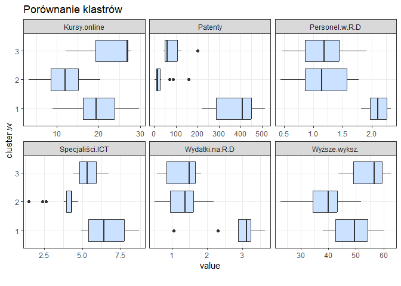<!-- -->

``` r
# grupowanie K-MEANS -----------------------------------------------------------

# wybierzmy na poczatek 4 grupy, utworzmy obiekt klasy kmeans, 
# pracujemy na danych ustandaryzowanych 
set.seed(10)
km1 <- kmeans(eu.scaled, centers = 4, nstart = 10)

km1$cluster        # podzial na grupy w elemencie cluster
```

    ##  [1] 3 4 4 3 3 1 1 4 1 3 4 4 1 4 1 2 4 1 2 3 4 4 4 3 4 2 2 1 4 4

``` r
km1$withinss       # wartosci sumy kwadratow odleglosci w poszczegolnych grupach
```

    ## [1] 17.04424 10.34235 10.05697 22.95862

``` r
km1$tot.withinss   # suma withinss, WSS 
```

    ## [1] 60.40218

``` r
## wybór liczby grup -----------------------------------------------------------


# wykres osypiska WSS
x <- rep(0, 10) 
for(i in 1:10)
  x[i] <- kmeans(eu.scaled, centers = i, nstart = 10)$tot.withinss

# wykres
plot(x, type = "b")
```

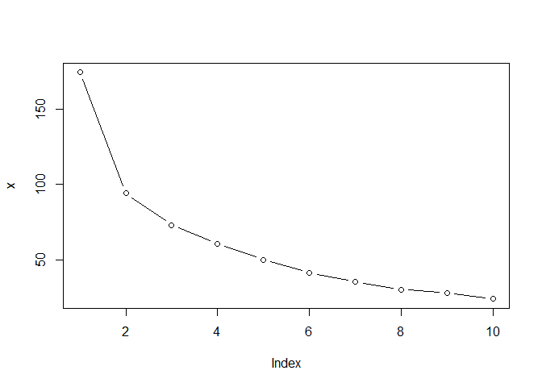<!-- -->

``` r
# wniosek: 2 grupy


# kryterium ch (Calinskiego-Harabasza)
km.ch <- kmeansruns(eu.scaled, criterion = "ch", runs = 10)

# wykres
plot(km.ch$crit, type = "b")
```

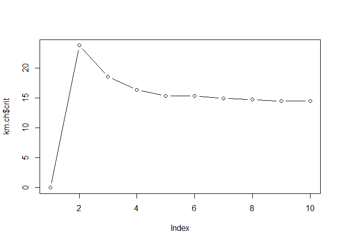<!-- -->

``` r
# wniosek: 2 grupy 


# kryterium asw (Average Silhouette
km.asw <- kmeansruns(eu.scaled, criterion = "asw", runs = 10)

# wykres
plot(km.asw$crit, type = "b")
```

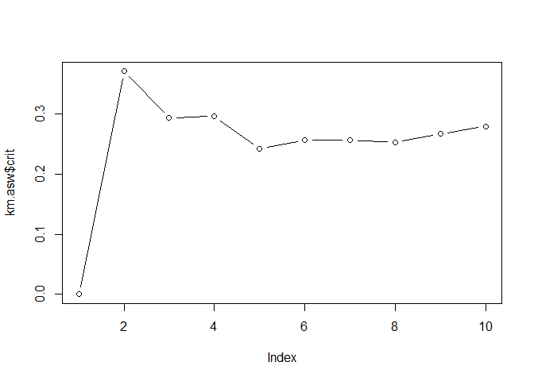<!-- -->

``` r
# wniosek: 2 lub 4  grupy


# WNIOSEK: wybieramy 2 grupy 
set.seed(10)
km1 <- kmeans(eu.scaled, centers = 2, nstart = 10)


# dokładamy grupowanie do ramki z danymi jako kolejna zmienna
eu$cluster.km <- km1$cluster %>% factor()


## CHARAKTERYSTYKA grup --------------------------------------------------------

# na podstawie wykresów interpretujemy powstałe grupy
plot_boxplot(eu, 
             by = "cluster.km", 
             ncol = 3, 
             geom_boxplot_args = list("fill" = "#CAE1FF"),
             title = "Porównanie klastrów", 
             ggtheme = theme_bw())
```

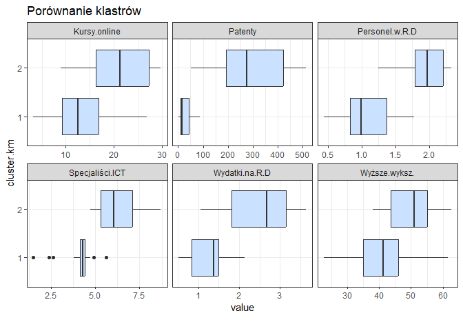<!-- -->

``` r
#zmieniamy kraje wysoko rozwinięte jako grupa 1
eu$cluster.km <- factor(eu$cluster.km,
                        levels = c(2,1),
                        labels = 1:2)

#sprawdzamy jeszcze raz
plot_boxplot(eu, 
             by = "cluster.km", 
             ncol = 3, 
             geom_boxplot_args = list("fill" = "#CAE1FF"),
             title = "Porównanie klastrów", 
             ggtheme = theme_bw())
```

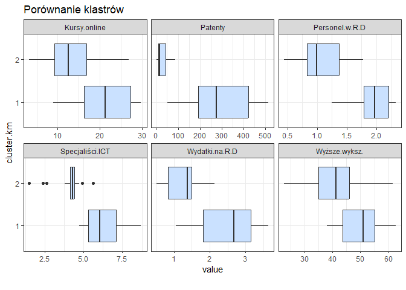<!-- -->

``` r
# stabilność grupy
clusterboot(eu.scaled, B = 500,
            clustermethod = kmeansCBI, krange = 2)
```

    ## boot 1 
    ## boot 2 
    ## boot 3 
    ## boot 4 
    ## boot 5 
    ## boot 6 
    ## boot 7 
    ## boot 8 
    ## boot 9 
    ## boot 10 
    ## boot 11 
    ## boot 12 
    ## boot 13 
    ## boot 14 
    ## boot 15 
    ## boot 16 
    ## boot 17 
    ## boot 18 
    ## boot 19 
    ## boot 20 
    ## boot 21 
    ## boot 22 
    ## boot 23 
    ## boot 24 
    ## boot 25 
    ## boot 26 
    ## boot 27 
    ## boot 28 
    ## boot 29 
    ## boot 30 
    ## boot 31 
    ## boot 32 
    ## boot 33 
    ## boot 34 
    ## boot 35 
    ## boot 36 
    ## boot 37 
    ## boot 38 
    ## boot 39 
    ## boot 40 
    ## boot 41 
    ## boot 42 
    ## boot 43 
    ## boot 44 
    ## boot 45 
    ## boot 46 
    ## boot 47 
    ## boot 48 
    ## boot 49 
    ## boot 50 
    ## boot 51 
    ## boot 52 
    ## boot 53 
    ## boot 54 
    ## boot 55 
    ## boot 56 
    ## boot 57 
    ## boot 58 
    ## boot 59 
    ## boot 60 
    ## boot 61 
    ## boot 62 
    ## boot 63 
    ## boot 64 
    ## boot 65 
    ## boot 66 
    ## boot 67 
    ## boot 68 
    ## boot 69 
    ## boot 70 
    ## boot 71 
    ## boot 72 
    ## boot 73 
    ## boot 74 
    ## boot 75 
    ## boot 76 
    ## boot 77 
    ## boot 78 
    ## boot 79 
    ## boot 80 
    ## boot 81 
    ## boot 82 
    ## boot 83 
    ## boot 84 
    ## boot 85 
    ## boot 86 
    ## boot 87 
    ## boot 88 
    ## boot 89 
    ## boot 90 
    ## boot 91 
    ## boot 92 
    ## boot 93 
    ## boot 94 
    ## boot 95 
    ## boot 96 
    ## boot 97 
    ## boot 98 
    ## boot 99 
    ## boot 100 
    ## boot 101 
    ## boot 102 
    ## boot 103 
    ## boot 104 
    ## boot 105 
    ## boot 106 
    ## boot 107 
    ## boot 108 
    ## boot 109 
    ## boot 110 
    ## boot 111 
    ## boot 112 
    ## boot 113 
    ## boot 114 
    ## boot 115 
    ## boot 116 
    ## boot 117 
    ## boot 118 
    ## boot 119 
    ## boot 120 
    ## boot 121 
    ## boot 122 
    ## boot 123 
    ## boot 124 
    ## boot 125 
    ## boot 126 
    ## boot 127 
    ## boot 128 
    ## boot 129 
    ## boot 130 
    ## boot 131 
    ## boot 132 
    ## boot 133 
    ## boot 134 
    ## boot 135 
    ## boot 136 
    ## boot 137 
    ## boot 138 
    ## boot 139 
    ## boot 140 
    ## boot 141 
    ## boot 142 
    ## boot 143 
    ## boot 144 
    ## boot 145 
    ## boot 146 
    ## boot 147 
    ## boot 148 
    ## boot 149 
    ## boot 150 
    ## boot 151 
    ## boot 152 
    ## boot 153 
    ## boot 154 
    ## boot 155 
    ## boot 156 
    ## boot 157 
    ## boot 158 
    ## boot 159 
    ## boot 160 
    ## boot 161 
    ## boot 162 
    ## boot 163 
    ## boot 164 
    ## boot 165 
    ## boot 166 
    ## boot 167 
    ## boot 168 
    ## boot 169 
    ## boot 170 
    ## boot 171 
    ## boot 172 
    ## boot 173 
    ## boot 174 
    ## boot 175 
    ## boot 176 
    ## boot 177 
    ## boot 178 
    ## boot 179 
    ## boot 180 
    ## boot 181 
    ## boot 182 
    ## boot 183 
    ## boot 184 
    ## boot 185 
    ## boot 186 
    ## boot 187 
    ## boot 188 
    ## boot 189 
    ## boot 190 
    ## boot 191 
    ## boot 192 
    ## boot 193 
    ## boot 194 
    ## boot 195 
    ## boot 196 
    ## boot 197 
    ## boot 198 
    ## boot 199 
    ## boot 200 
    ## boot 201 
    ## boot 202 
    ## boot 203 
    ## boot 204 
    ## boot 205 
    ## boot 206 
    ## boot 207 
    ## boot 208 
    ## boot 209 
    ## boot 210 
    ## boot 211 
    ## boot 212 
    ## boot 213 
    ## boot 214 
    ## boot 215 
    ## boot 216 
    ## boot 217 
    ## boot 218 
    ## boot 219 
    ## boot 220 
    ## boot 221 
    ## boot 222 
    ## boot 223 
    ## boot 224 
    ## boot 225 
    ## boot 226 
    ## boot 227 
    ## boot 228 
    ## boot 229 
    ## boot 230 
    ## boot 231 
    ## boot 232 
    ## boot 233 
    ## boot 234 
    ## boot 235 
    ## boot 236 
    ## boot 237 
    ## boot 238 
    ## boot 239 
    ## boot 240 
    ## boot 241 
    ## boot 242 
    ## boot 243 
    ## boot 244 
    ## boot 245 
    ## boot 246 
    ## boot 247 
    ## boot 248 
    ## boot 249 
    ## boot 250 
    ## boot 251 
    ## boot 252 
    ## boot 253 
    ## boot 254 
    ## boot 255 
    ## boot 256 
    ## boot 257 
    ## boot 258 
    ## boot 259 
    ## boot 260 
    ## boot 261 
    ## boot 262 
    ## boot 263 
    ## boot 264 
    ## boot 265 
    ## boot 266 
    ## boot 267 
    ## boot 268 
    ## boot 269 
    ## boot 270 
    ## boot 271 
    ## boot 272 
    ## boot 273 
    ## boot 274 
    ## boot 275 
    ## boot 276 
    ## boot 277 
    ## boot 278 
    ## boot 279 
    ## boot 280 
    ## boot 281 
    ## boot 282 
    ## boot 283 
    ## boot 284 
    ## boot 285 
    ## boot 286 
    ## boot 287 
    ## boot 288 
    ## boot 289 
    ## boot 290 
    ## boot 291 
    ## boot 292 
    ## boot 293 
    ## boot 294 
    ## boot 295 
    ## boot 296 
    ## boot 297 
    ## boot 298 
    ## boot 299 
    ## boot 300 
    ## boot 301 
    ## boot 302 
    ## boot 303 
    ## boot 304 
    ## boot 305 
    ## boot 306 
    ## boot 307 
    ## boot 308 
    ## boot 309 
    ## boot 310 
    ## boot 311 
    ## boot 312 
    ## boot 313 
    ## boot 314 
    ## boot 315 
    ## boot 316 
    ## boot 317 
    ## boot 318 
    ## boot 319 
    ## boot 320 
    ## boot 321 
    ## boot 322 
    ## boot 323 
    ## boot 324 
    ## boot 325 
    ## boot 326 
    ## boot 327 
    ## boot 328 
    ## boot 329 
    ## boot 330 
    ## boot 331 
    ## boot 332 
    ## boot 333 
    ## boot 334 
    ## boot 335 
    ## boot 336 
    ## boot 337 
    ## boot 338 
    ## boot 339 
    ## boot 340 
    ## boot 341 
    ## boot 342 
    ## boot 343 
    ## boot 344 
    ## boot 345 
    ## boot 346 
    ## boot 347 
    ## boot 348 
    ## boot 349 
    ## boot 350 
    ## boot 351 
    ## boot 352 
    ## boot 353 
    ## boot 354 
    ## boot 355 
    ## boot 356 
    ## boot 357 
    ## boot 358 
    ## boot 359 
    ## boot 360 
    ## boot 361 
    ## boot 362 
    ## boot 363 
    ## boot 364 
    ## boot 365 
    ## boot 366 
    ## boot 367 
    ## boot 368 
    ## boot 369 
    ## boot 370 
    ## boot 371 
    ## boot 372 
    ## boot 373 
    ## boot 374 
    ## boot 375 
    ## boot 376 
    ## boot 377 
    ## boot 378 
    ## boot 379 
    ## boot 380 
    ## boot 381 
    ## boot 382 
    ## boot 383 
    ## boot 384 
    ## boot 385 
    ## boot 386 
    ## boot 387 
    ## boot 388 
    ## boot 389 
    ## boot 390 
    ## boot 391 
    ## boot 392 
    ## boot 393 
    ## boot 394 
    ## boot 395 
    ## boot 396 
    ## boot 397 
    ## boot 398 
    ## boot 399 
    ## boot 400 
    ## boot 401 
    ## boot 402 
    ## boot 403 
    ## boot 404 
    ## boot 405 
    ## boot 406 
    ## boot 407 
    ## boot 408 
    ## boot 409 
    ## boot 410 
    ## boot 411 
    ## boot 412 
    ## boot 413 
    ## boot 414 
    ## boot 415 
    ## boot 416 
    ## boot 417 
    ## boot 418 
    ## boot 419 
    ## boot 420 
    ## boot 421 
    ## boot 422 
    ## boot 423 
    ## boot 424 
    ## boot 425 
    ## boot 426 
    ## boot 427 
    ## boot 428 
    ## boot 429 
    ## boot 430 
    ## boot 431 
    ## boot 432 
    ## boot 433 
    ## boot 434 
    ## boot 435 
    ## boot 436 
    ## boot 437 
    ## boot 438 
    ## boot 439 
    ## boot 440 
    ## boot 441 
    ## boot 442 
    ## boot 443 
    ## boot 444 
    ## boot 445 
    ## boot 446 
    ## boot 447 
    ## boot 448 
    ## boot 449 
    ## boot 450 
    ## boot 451 
    ## boot 452 
    ## boot 453 
    ## boot 454 
    ## boot 455 
    ## boot 456 
    ## boot 457 
    ## boot 458 
    ## boot 459 
    ## boot 460 
    ## boot 461 
    ## boot 462 
    ## boot 463 
    ## boot 464 
    ## boot 465 
    ## boot 466 
    ## boot 467 
    ## boot 468 
    ## boot 469 
    ## boot 470 
    ## boot 471 
    ## boot 472 
    ## boot 473 
    ## boot 474 
    ## boot 475 
    ## boot 476 
    ## boot 477 
    ## boot 478 
    ## boot 479 
    ## boot 480 
    ## boot 481 
    ## boot 482 
    ## boot 483 
    ## boot 484 
    ## boot 485 
    ## boot 486 
    ## boot 487 
    ## boot 488 
    ## boot 489 
    ## boot 490 
    ## boot 491 
    ## boot 492 
    ## boot 493 
    ## boot 494 
    ## boot 495 
    ## boot 496 
    ## boot 497 
    ## boot 498 
    ## boot 499 
    ## boot 500

    ## * Cluster stability assessment *
    ## Cluster method:  kmeans 
    ## Full clustering results are given as parameter result
    ## of the clusterboot object, which also provides further statistics
    ## of the resampling results.
    ## Number of resampling runs:  500 
    ## 
    ## Number of clusters found in data:  2 
    ## 
    ##  Clusterwise Jaccard bootstrap (omitting multiple points) mean:
    ## [1] 0.9425313 0.9126249
    ## dissolved:
    ## [1] 0 2
    ## recovered:
    ## [1] 491 454

``` r
# PORÓWNANIE GRUPOWAŃ ----------------------------------------------------------

table(eu$cluster.w, eu$cluster.km)
```

    ##    
    ##      1  2
    ##   1  8  0
    ##   2  1 14
    ##   3  3  4

``` r
# PCA i grupwanie razem --------------------------------------------------------

# dokładamy etykietki grupowań do ramki danych z wartościami 
# nowych wymiarów
eu.RC$cluster.w <- eu$cluster.w
eu.RC$cluster.km <- eu$cluster.km


# nowe wymiary i grupowanie hierarhiczne wardera
eu.RC %>% 
  ggplot( aes( x=`Poziom zaangażowania kraju w badania i rozwój`,
               y = `Poziom wykształcenia i wiedzy społeczeństwa`))+
  geom_point( aes( color= cluster.w), size = 1.7)+
  geom_text(aes(label = Kraj), vjust = -1, size = 2.5)+
  theme_light()+
  labs(title = "Rozmieszczenie krajów w przestrzeni nowych składowych")
```

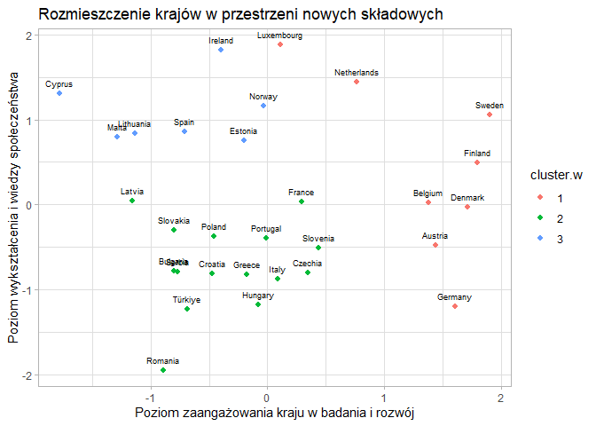<!-- -->

``` r
# nowe wymiary i grupowanie kmeans
eu.RC %>% 
  ggplot( aes( x=`Poziom zaangażowania kraju w badania i rozwój`,
               y = `Poziom wykształcenia i wiedzy społeczeństwa`))+
  geom_point( aes( color= cluster.km),size = 1.7)+
  geom_text(aes(label = Kraj), vjust = -1, size = 2.5)+
  theme_light()+
  labs(title = "Rozmieszczenie krajów w przestrzeni nowych składowych")
```

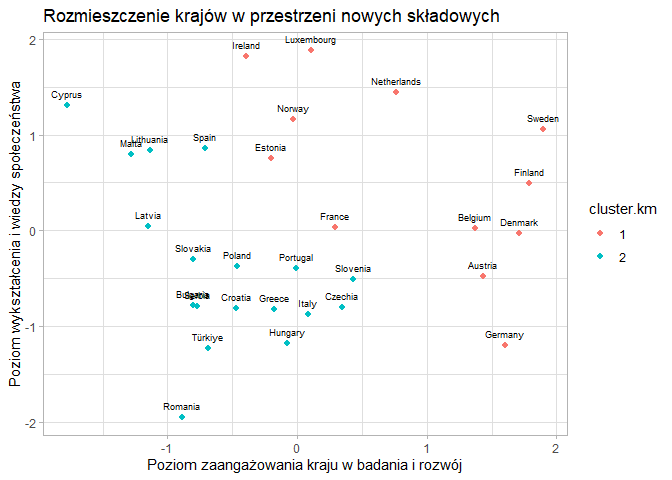<!-- -->

``` r
# nowe wymiary i grupowanie wardera + elipsa
eu.RC %>% 
  ggplot(aes(x = `Poziom zaangażowania kraju w badania i rozwój`, 
             y = `Poziom wykształcenia i wiedzy społeczeństwa`,
             color = factor(cluster.w))) + 
  geom_point() +
  stat_ellipse(aes(fill = factor(cluster.w)), 
               geom = "polygon", 
               alpha = 0.15, 
               level = 0.95) + 
  geom_text(aes(label = Kraj), vjust = -1, size = 2.5) +
  theme_light() +
  labs(title = "Rozmieszczenie krajów w przestrzeni nowych składowych",
       color = "Klaster",
       fill = "Klaster")
```

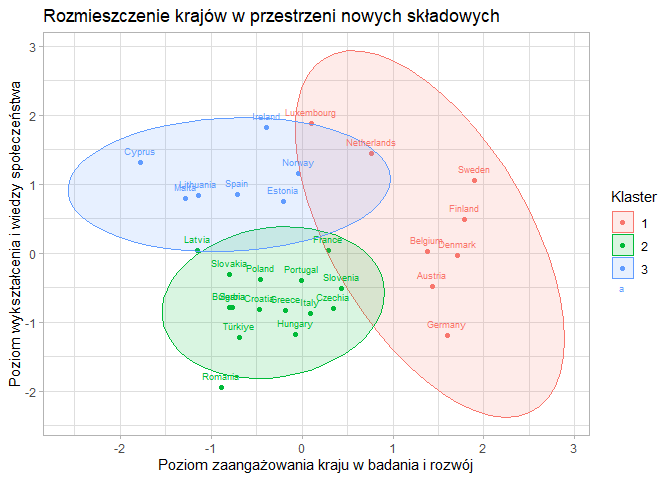<!-- -->

``` r
# nowe wymiary i grupowanie kmean + elipsa
eu.RC %>% 
  ggplot(aes(x = `Poziom zaangażowania kraju w badania i rozwój`, 
             y = `Poziom wykształcenia i wiedzy społeczeństwa`,
             color = factor(cluster.km))) + 
  geom_point() +
  stat_ellipse(aes(fill = factor(cluster.km)), 
               geom = "polygon", 
               alpha = 0.15, 
               level = 0.95) + 
  geom_text(aes(label = Kraj), vjust = -1, size = 2.5) +
  theme_light() +
  labs(title = "Rozmieszczenie krajów w przestrzeni nowych składowych",
       color = "Klaster",
       fill = "Klaster")
```

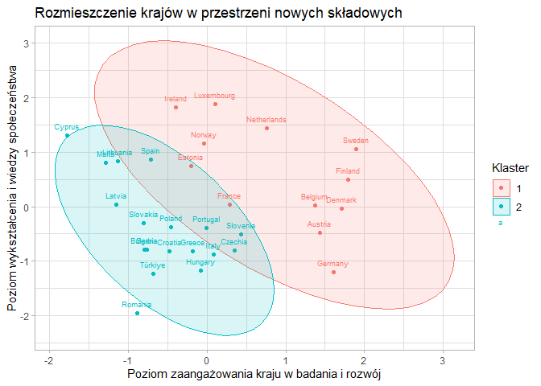<!-- -->
